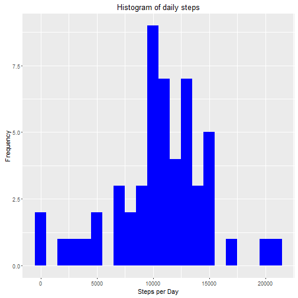
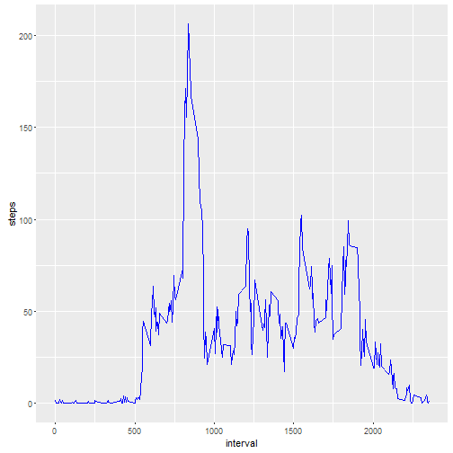
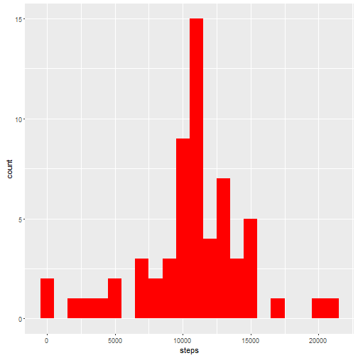
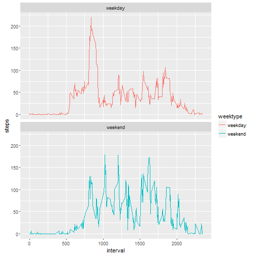

## Introduction 
This assignment makes use of data from a personal activity monitoring device. This device collects data at 5 minute intervals through out the day. The data consists of two months of data from an anonymous individual collected during the months of October and November, 2012 and include the number of steps taken in 5 minute intervals each day.

The variables included in this dataset are:

steps: Number of steps taking in a 5-minute interval (missing values are coded as NA)  
date: The date on which the measurement was taken in YYYY-MM-DD format  
interval: Identifier for the 5-minute interval in which measurement was taken

set our working directory

```r
setwd("C:/Users/Jason Nefelim/Desktop/Assingments/5 Repoducily Reasearch/Week 2")
```

## Packages load

```r
library(knitr)
library(ggplot2)
library(lubridate)
library(dplyr)
```


## Loading our Data


```r
Data<- read.csv("activity.csv",header = TRUE,sep = "," , colClasses = c("numeric","character","integer"))
```
 
### Tyding the Data
Set the date

```r
Data$date <- ymd(Data$date)
```

A view on our Data

```r
str(Data)
```

```
## 'data.frame':	17568 obs. of  3 variables:
##  $ steps   : num  NA NA NA NA NA NA NA NA NA NA ...
##  $ date    : Date, format: "2012-10-01" "2012-10-01" ...
##  $ interval: int  0 5 10 15 20 25 30 35 40 45 ...
```

```r
head(Data)
```

```
##   steps       date interval
## 1    NA 2012-10-01        0
## 2    NA 2012-10-01        5
## 3    NA 2012-10-01       10
## 4    NA 2012-10-01       15
## 5    NA 2012-10-01       20
## 6    NA 2012-10-01       25
```

## What is mean total number of steps taken per day?

For this answer we will ingore the NA values 
First we call our data then we remove the NA values, after we group the data by the date and finaly we summ the steps by date.

1. Calculate the total number of steps taken per day

```r
steps<- Data %>% filter(!is.na(steps))%>% group_by(date)%>% summarize(steps=sum(steps))
head(steps)
```

```
## # A tibble: 6 × 2
##         date steps
##       <date> <dbl>
## 1 2012-10-02   126
## 2 2012-10-03 11352
## 3 2012-10-04 12116
## 4 2012-10-05 13294
## 5 2012-10-06 15420
## 6 2012-10-07 11015
```

2.Make a histogram of the total number of steps taken each day

```r
ggplot(steps, aes(x=steps))+
  geom_histogram(fill="blue", binwidth = 1000)+
  labs(title="Histogram of daily steps", x="Steps per Day", y="Frequency")       
```




3.Calculate and report the mean and median of the total number of steps taken per day

```r
av<- mean(steps$steps)
me<- median(steps$steps)
```

The mean  of the daily steps are  10766  and their median is 10765 .


## What is the average daily activity pattern?

1.Make a time series plot (i.e. type = "l") of the 5-minute interval (x-axis) and the average number of steps taken, averaged across all days (y-axis)
calculate the average number pf steps taken in 5-min interval per day

```r
interval<- Data %>% 
  filter(!is.na(steps)) %>% 
  group_by(interval) %>% 
  summarise(steps=mean(steps))
```

Time series plot of the 5-minute interval.

```r
ggplot(interval, aes(x=interval,y=steps))+
  geom_line(color="blue")
```



Which 5-minute interval, on average across all the days in the dataset, contains the maximum number of steps?

```r
i<-interval[which.max(interval$steps),]
```


The 835 interval has the maximum cout of steps with 206 steps!


##Imputing missing values

1.Calculate and report the total number of missing values in the dataset 


```r
na<- sum( is.na(Data$steps))
```

The total missing NA values are  2304


2.Devise a strategy for filling in all of the missing values in the dataset.
3.Create a new dataset that is equal to the original dataset but with the missing data filled in.

Here we are filling with the average number of steprs per 5 min.

```r
Full<- Data
nas<- is.na(Full$steps)
average_inter<- tapply(Full$steps, Full$interval, mean, na.rm=TRUE, simplify= TRUE)
Full$steps[nas]<-average_inter[as.character(Full$interval[nas])]

f<- sum(is.na(Full$steps))
```

We have filled up our new datasheer as we can see the are  0 NAs now.


4.1 Calculate the steps taken per day


```r
Fsteps<- Full %>% 
  group_by(date) %>% 
  summarise(steps=sum(steps))

head(Fsteps)
```

```
## # A tibble: 6 × 2
##         date    steps
##       <date>    <dbl>
## 1 2012-10-01 10766.19
## 2 2012-10-02   126.00
## 3 2012-10-03 11352.00
## 4 2012-10-04 12116.00
## 5 2012-10-05 13294.00
## 6 2012-10-06 15420.00
```

4.2 The new Histogram 


```r
ggplot(Fsteps,aes(x=steps))+
  geom_histogram(fill="red",binwidth = 1000)
```




```r
avgf<- mean(Fsteps$steps)
medf<- median(Fsteps$steps)
```

The mean of the our full data is 10766 and it has a 10766  median! And we are not suprised tha the median and the mean are the same.


##Are there differences in activity patterns between weekdays and weekends?


1. Define if we are during a weekday or a week end

```r
is.weekday<- function(d) {
  wd<-weekdays(d)
  ifelse(wd=="saturday"|wd=="Sunday","weekend","weekday")
}

dday<-sapply(Full$date,is.weekday)
Full$weektype<- as.factor(dday)

head(Full)
```

```
##       steps       date interval weektype
## 1 1.7169811 2012-10-01        0  weekday
## 2 0.3396226 2012-10-01        5  weekday
## 3 0.1320755 2012-10-01       10  weekday
## 4 0.1509434 2012-10-01       15  weekday
## 5 0.0754717 2012-10-01       20  weekday
## 6 2.0943396 2012-10-01       25  weekday
```

2.Calculate the average steps in 5-min interval for weekdays and weekends and make a line graph.


```r
avgsteps<- Full %>%
    group_by(interval, weektype) %>%
  summarise(steps=mean(steps))

line<- ggplot(avgsteps, aes(x=interval,y=steps,color=weektype))+ 
  geom_line()+
  facet_wrap(~weektype, ncol=1,nrow=2)
print(line)
```




From our line graph we can see that during the weekdays the test object is more active in early times in comparison with weekends that is more active in later ours as an explanation is that during the weekdays the object is working so he moves less than weekends.


